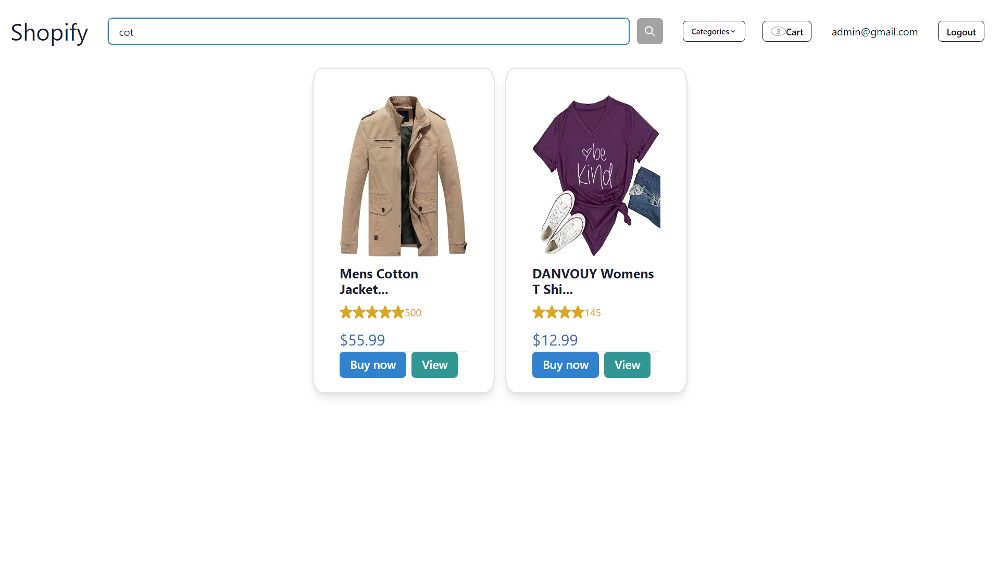
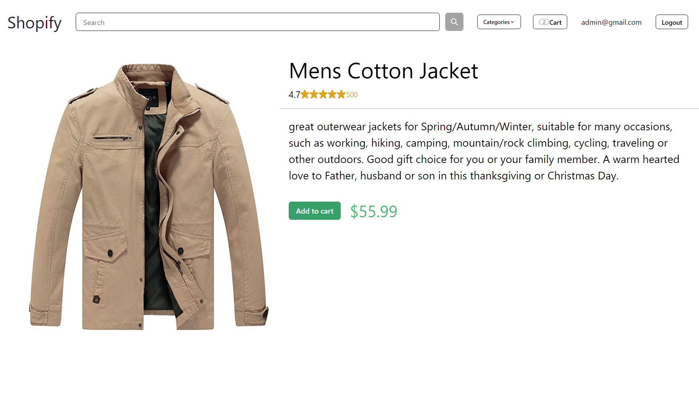
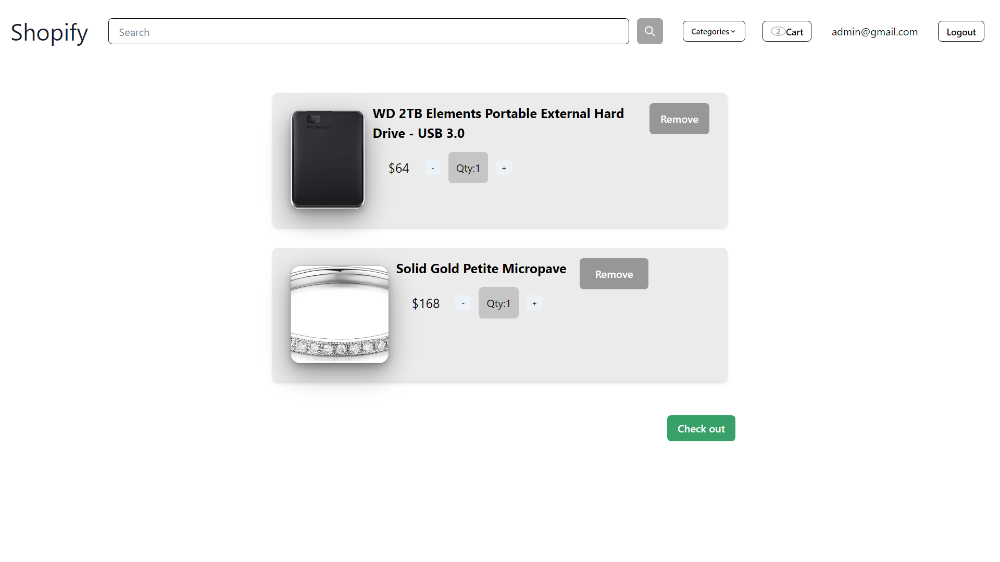
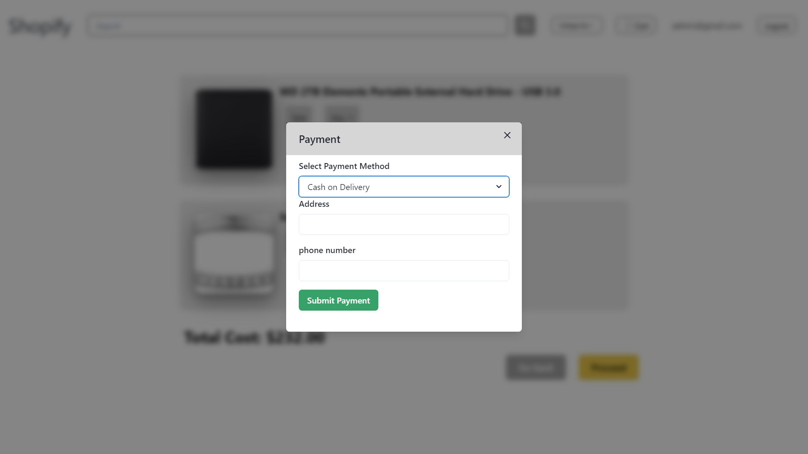

# Shop-ify
Welcome to my e-commerce website, designed to showcase the functionality of an online shopping experience! In my platform, you can search for products and explore different categories to find what you're looking for.Once you find a product you like, click on the "Add to Cart" button to include it in your virtual shopping cart. This allows you to keep track of your selected items as you continue browsing. In the cart, you can review the items, adjust quantities, and remove products if needed. While this feature does not facilitate actual purchases in this project, it showcases the process of adding items to a cart before proceeding to checkout.
Some screenshots of my webpage:
 
### Home page

### Search function

### Product page

### Cart

### payment

